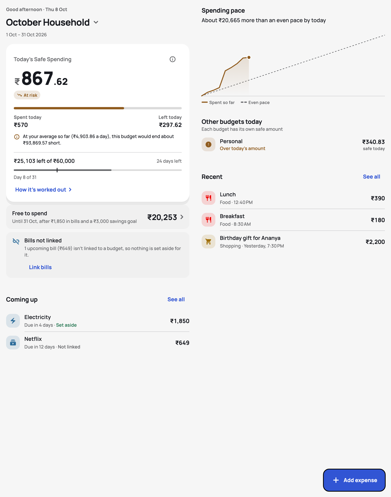
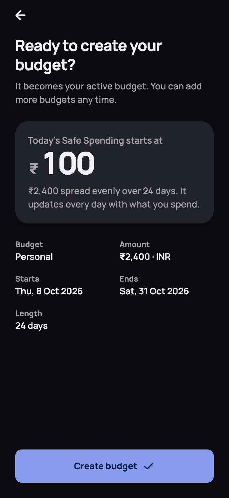
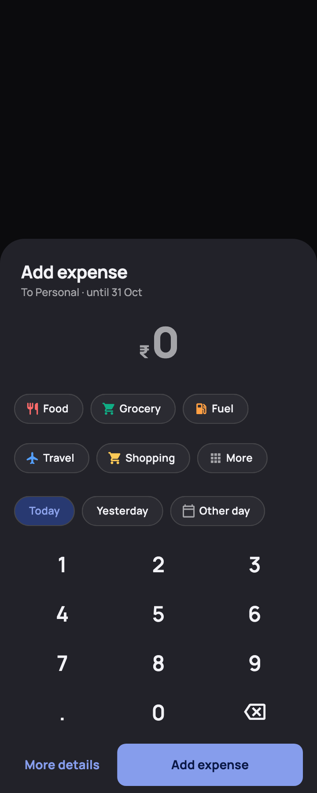
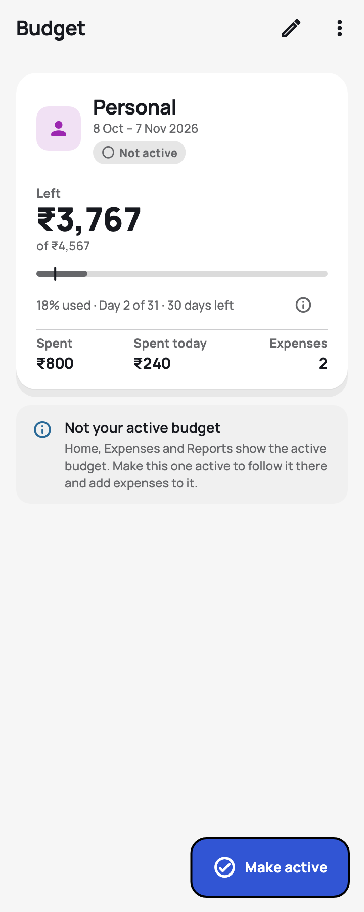
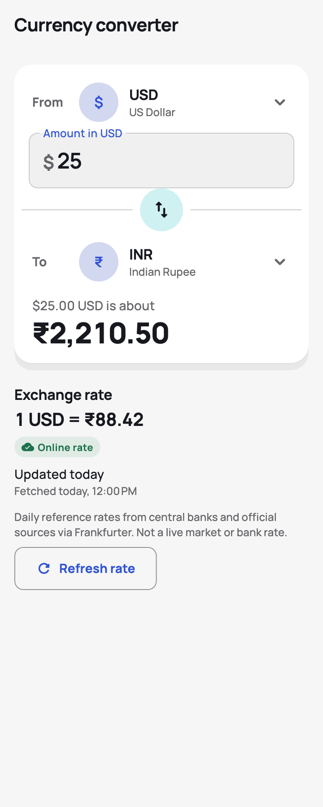
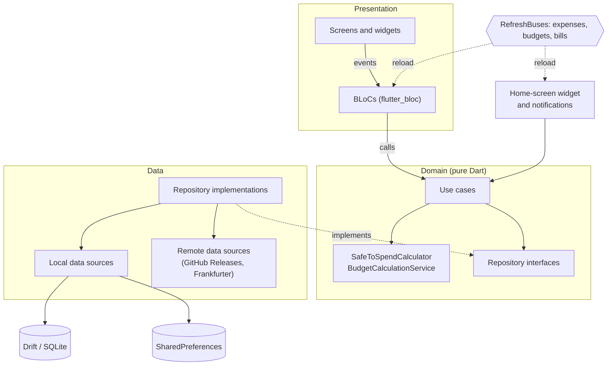

# Monivo — Smart Budget Tracker

**Know what you can spend today.**

Monivo is an offline-first budgeting app for Android and iOS, built with Flutter. You give
each budget an amount and your own start and end dates. Monivo then works out one daily
number, **Today's Safe Spending**: how much you can spend today and still make the money
last to the end of the period, after upcoming bills, money you've kept aside and your
savings goal are protected.


**Repository:** <https://github.com/sufiyansakkeer/budget_tracker> ·
**Version:** `1.0.0+1` ([`pubspec.yaml`](pubspec.yaml)) ·
**Status:** in active development; not yet published to an app store or as a GitHub
Release, so build it from source ([Getting started](#getting-started)).

---

## Preview

<p align="center">
  
  <br>
  <sub><b>Home</b> (two-column tablet layout): Today's Safe Spending with its status,
  what's free to spend after bills and a savings goal, upcoming bills, spending pace and
  other budgets running today.</sub>
</p>

<table>
  <tr>
    <td align="center" width="25%"></td>
    <td align="center" width="25%"></td>
    <td align="center" width="25%"></td>
    <td align="center" width="25%"></td>
  </tr>
  <tr>
    <td align="center"><sub><b>Onboarding</b>: previews the first day's safe amount before the budget is created</sub></td>
    <td align="center"><sub><b>Quick add</b>: amount pad, most-used categories, Today / Yesterday</sub></td>
    <td align="center"><sub><b>Budget details</b>: what's left, day of the period, spent today</sub></td>
    <td align="center"><sub><b>Currency converter</b>: cached daily reference rates that keep working offline</sub></td>
  </tr>
</table>

<sub>These images are rendered by the project's golden-test suite
([`test/goldens/`](test/goldens/)) from fixed sample data. They show the real app widgets and
bundled fonts, without device chrome. Every screen is checked in light and dark, at 100%
and 200% text size.</sub>

<!--
TODO(screenshots): add real device captures, e.g. under docs/screenshots/:
  - Android and iOS home-screen widgets on a home screen (the native widgets have no golden)
  - Home on a phone, cropped to the first screen (home.light.1x.png is 720×4000)
  - Reports (charts) and the Color palette screen, cropped to one screen height
  - Optional: a short GIF of quick add → Home updating
-->

---

## Why Monivo

Most expense trackers answer *"what did I spend?"* Monivo answers *"what can I spend
today?"*, the question you have at the till.

- **Built for real budget periods.** A budget runs on your dates, not the calendar month:
  a salary cycle, a two-week trip, a household month. Several can run at once, and their
  money is never pooled.
- **One number that already accounts for what's coming.** Today's Safe Spending sets aside
  bills due before the period ends, money you've kept aside and your savings goal. It stays
  fixed for the day, so recording a coffee doesn't make the target move.
- **It explains itself.** A status (*On track*, *Spend carefully*, *At risk*,
  *Over budget*…), a "How it's worked out" breakdown and a forecast show where the number
  comes from.
- **Private by default.** No account, no backend, no analytics. Everything is stored on the
  device. The only network calls are an optional update check and the optional currency
  converter.

It is aimed at people who budget a fixed amount over a fixed period and want a daily
guide rather than a month-end report.

---

## Key features

**Budgets**
- Any number of budgets, each with its own amount, currency and start/end dates; periods
  may overlap. One **active budget** drives Home, Expenses, Reports and the widget.
- Optional **kept aside** amount and **savings goal** per budget, both protected in the
  daily figure.
- Edit, duplicate, archive (keeps its expenses) or delete (removes them).
  **Start new budget period**
  archives the active budget and creates a fresh 31-day one in a single transaction. It
  carries over the settings and re-links the old budget's unpaid bills.

**Expenses**
- **Quick add** from a bottom sheet: number pad, five category shortcuts led by the ones
  you used most in the last 90 days, and Today / Yesterday / another day. "More details" opens the full form, which has note, time,
  tags and a receipt photo (camera or gallery).
- **Swipe to delete with Undo**, plus press-and-hold for Edit, Duplicate, Move to another
  budget, Delete. A move updates both budgets atomically.
- History grouped by day, with search, paging, six sort orders, combinable filters
  (category, dates, amount range, tags, has receipt) and date presets.
- **Combined view** lists several budgets' expenses together without merging the budgets.
  When their currencies differ, it shows one total per currency.
- 13 built-in categories plus your own (icon and colour, rename, archive, delete when
  unused).

**Bills and reminders**
- One-time or recurring bills (weekly, monthly or yearly, with an interval). Status
  (*Upcoming*, *Due today*, *Overdue*, *Paid*) is derived from dates, never stored.
- **Link a bill to a budget** and its upcoming occurrences are set aside in that budget's
  safe amount. **Mark paid & record expense** writes the payment, the expense and the next
  due date in one transaction.
- Grouped as Overdue / Due soon / Later / Paid, with unpaid totals per currency. Each bill
  can have a local reminder on the due date or 1, 2, 3 or 7 days before.

**Reports**
- Periods: *This Budget*, this/last week, this/last month, this year or a custom range.
- Total spent compared with the same number of days just before; planned vs actual;
  category ranking and biggest movers; day-by-day columns; weekly or monthly buckets;
  spending by weekday.
- Export the report as **CSV or PDF** through the system share sheet.

**Home-screen widgets** (Android App Widget, iOS WidgetKit small/medium/large)
- Shows the active budget's safe amount and status. Depending on size it also shows
  today's progress, what's left, and an **Add expense** button that opens the form
  directly.
- Fits its slot: Android chooses among eleven layouts, measured at the current font size,
  and iOS uses `ViewThatFits`, so larger text gets a simpler layout instead of clipped
  figures. After midnight it shows "Tap to update" rather than yesterday's amount.

**Everything else**
- **Notifications:** a morning Today's Safe Spending (one line per running budget) and an
  evening summary, under one switch with adjustable times, plus bill reminders. They survive
  device restarts.
- **Appearance:** Light, Dark or System mode and eight colour palettes, all meeting WCAG AA
  contrast (enforced by tests). Material 3 throughout, motion that respects the platform's
  reduced-motion setting, and a two-column Home on wide screens.
- **Currencies:** ten app currencies (INR, USD, EUR, AED, OMR, GBP, CAD, AUD, JPY, SGD),
  formatted by one central formatter. That includes the new Omani rial sign (U+20C4),
  shipped as a bundled fallback font because system fonts don't have it yet.
- **Currency converter:** cache-first, using [Frankfurter](https://frankfurter.dev/) daily
  reference rates. It shows the rate date and source and keeps working offline with the
  last saved rate.
- **Security and data:** optional biometric app lock; CSV/JSON export and import; full
  JSON backup and restore (restore runs in one transaction); an on-demand database health
  check.
- **Home insights:** up to two rule-based observations ("Worth knowing"), computed on the
  device from your own figures.
- **Onboarding:** seven steps, ending with a preview of the first day's safe amount.

---

## How Safe to Spend works

Each budget is calculated on its own; amounts are never combined across budgets.

```text
A  Remaining      = budget amount − spent so far this period
B  Bills          = unpaid occurrences of bills linked to this budget, due by its end date
C  Kept aside     = optional amount reserved in the budget
D  Savings goal   = optional savings target for the period

Spendable         = A − B − C − D
Safe today        = max(0, (Spendable + today's discretionary spending) ÷ days left, today included)
Left today        = Safe today − today's discretionary spending
```

*Discretionary* means today's spending minus payments of bills this budget had already set
aside.

**Rules that shape the number**

- **Fixed for the day.** Today's discretionary spending is added back before dividing, so
  the limit doesn't shrink with every purchase; today's spending is measured against it.
  At midnight it is recalculated from what is actually left: unspent money raises
  tomorrow's figure, overspending lowers it.
- **Paying a planned bill doesn't cost today's allowance.** The payment moves from B into
  spending, so Spendable is unchanged.
- **Never optimistic by accident.** If bills can't be read, the breakdown says
  *Unavailable* (not ₹0) and the status is capped at *Spend carefully*. Displayed safe
  amounts are rounded **down** to the currency's minor unit, so the app never shows more
  than is there.
- **The forecast is informational.** It uses completed days only, needs at least three of
  them, and never changes today's amount. It projects the end balance and, when spending is
  too fast, the date the money runs out.

**Example.** A ₹30,000 budget for 1–30 Aug. On 9 Aug (22 days left, today included):
₹6,000 has been spent, ₹300 of it today. A ₹2,200 electricity bill linked to the budget is
due on 15 Aug, ₹1,000 is kept aside and the savings goal is ₹2,000.

| Step | Value |
| --- | --- |
| Remaining (A) | 30,000 − 6,000 = ₹24,000 |
| Spendable | 24,000 − 2,200 − 1,000 − 2,000 = ₹18,800 |
| **Safe today** | (18,800 + 300) ÷ 22 = **₹868.18** |
| Left today | 868.18 − 300 = ₹568.18 |
| Without bills, kept aside and savings | (24,000 + 300) ÷ 22 = ₹1,104.55 |

If the bill is paid today with *Mark paid & record expense*, Safe today stays ₹868.18.

The status is the first rule that matches: *Not started*, *Ended*, *Over budget*,
*Overcommitted* (bills and reserves exceed what's left), *Over today's amount*, *At risk*
(forecast ends short), *Spend carefully*, *On track*.

Every formula, edge case and threshold is documented in
[`CALCULATION_RULES.md`](lib/features/budget/CALCULATION_RULES.md); the design reasoning is
in [`docs/architecture/safe_spending.md`](docs/architecture/safe_spending.md). Monivo does
arithmetic on the figures you enter; it does not give financial advice.

---

## Architecture

Monivo uses Clean Architecture with a feature-first layout: each feature under
`lib/features/` has its own `data/`, `domain/` and `presentation/` layers. BLoCs are the
only place UI state is produced, and the domain layer is plain Dart.


```mermaid
flowchart TB
    subgraph Presentation
        UI["Screens and widgets"] -- events --> BLOC["BLoCs (flutter_bloc)"]
    end
    subgraph Domain["Domain (pure Dart)"]
        UC["Use cases"] --> ENGINE["SafeToSpendCalculator<br/>BudgetCalculationService"]
        UC --> REPO["Repository interfaces"]
    end
    subgraph Data
        IMPL["Repository implementations"] --> LOCAL["Local data sources"]
        IMPL --> REMOTE["Remote data sources<br/>(GitHub Releases, Frankfurter)"]
    end
    BLOC -- calls --> UC
    IMPL -. implements .-> REPO
    LOCAL --> DB[("Drift / SQLite")]
    LOCAL --> PREFS[("SharedPreferences")]
    BUS{{"RefreshBuses: expenses, budgets, bills"}} -. reload .-> BLOC
    BUS -. reload .-> NATIVE["Home-screen widget<br/>and notifications"]
    NATIVE --> UC
```

### Engineering decisions

- **One engine for every money figure.** `SafeToSpendCalculator` and
  `BudgetCalculationService` are pure classes with no Flutter, database or clock
  dependencies. The Home hero, "Other budgets today", the morning notification, the
  home-screen widget and the onboarding preview all read their result through use cases.
  No other code divides a remaining amount by remaining days, so every screen shows the
  same number.
- **Money as integers.** `MoneyMath` converts amounts to integer minor units once, and all
  sums and comparisons run on integers (with `BigInt` for long-period products). This
  avoids floating-point drift: 0.1 + 0.2 is exactly 0.3. The converter uses an exact
  decimal type with a single final rounding.
- **Calendar-correct dates.** Day counts compare calendar dates in UTC, so a 23-hour
  daylight-saving day still counts as one day.
- **Decoupled refresh.** Features don't call each other. A write notifies a payload-free
  `RefreshBus`, and every listener (BLoCs, the widget, notification scheduling) re-reads
  from its repository, so nothing acts on a stale copy.
- **Typed results instead of thrown exceptions.** Use cases return sealed result types
  (`BudgetResult`, `ExpenseResult`, `BillResult`, …) with success and failure variants.
  Presentation maps failures to plain-language messages.
- **The database does the heavy lifting.** Foreign keys are enforced, aggregates are SQL
  `SUM`/`COUNT` over a `(budget_id, date)` index, multi-row writes run in transactions, and
  schema migrations (v1 → v8) are tested against fixture databases.
- **The widget shows the same numbers as the app.** Dart formats every figure into one
  JSON payload; Kotlin (RemoteViews) and Swift (WidgetKit) only lay it out.
- **Accessibility is guarded by tests.** Palette contrast is checked, tap-target and
  contrast guideline tests exist, screens are golden-tested at 200% text, and amounts have
  spoken forms for screen readers.

More detail: [`docs/architecture/`](docs/architecture/README.md) explains why this stack
(Drift, BLoC, Clean Architecture, get_it), along with multiple budgets, offline-first,
notifications, navigation and backup/restore.

---

## Tech stack

| Area | Technology | Role |
| --- | --- | --- |
| Framework | Flutter 3.32, Dart `^3.8.1` | Single codebase for Android and iOS; Material 3 UI |
| State management | `flutter_bloc`, `equatable` | Event-driven BLoCs with immutable, value-equal states (14 BLoCs) |
| Navigation | `go_router` | Declarative routes; `StatefulShellRoute` keeps each bottom tab's stack |
| Dependency injection | `get_it` | Wires data sources, repositories, use cases and BLoCs |
| Persistence | `drift`, `sqlite3_flutter_libs` | Typed SQLite with versioned, tested migrations |
| Preferences | `shared_preferences` | Small flags such as the active budget id and onboarding state |
| Charts | `fl_chart` | Day-by-day, weekly/monthly and spending-pace charts |
| Notifications | `flutter_local_notifications`, `timezone`, `flutter_timezone` | Local reminders scheduled in the device's time zone |
| Home-screen widget | `home_widget`, Kotlin, SwiftUI | Shares one payload with native widgets via an App Group / shared prefs |
| Security | `local_auth` | Optional biometric app lock |
| Import / export | `csv`, `pdf`, `file_picker`, `share_plus` | CSV/JSON/PDF export, import and backups |
| Networking | `http` | GitHub Releases update check and Frankfurter rates |
| Other | `intl`, `image_picker`, `uuid`, `provider`, `package_info_plus`, `url_launcher` | Formatting, receipts, ids, currency notifier, app info, links |
| Testing | `flutter_test`, `bloc_test`, `mockito`, `sqlite3` | Unit, BLoC, widget, integration, migration and golden tests |

Code generation is limited to Drift (`app_database.g.dart`) and Mockito mocks. Entities
are hand-written with `Equatable`; the project does not use Freezed or json_serializable.

---

## Project structure

```text
lib/
├── main.dart                  Bootstrap, DI, widget deep links, root widget
├── core/
│   ├── database/              Drift schema (v8), migrations, generated code
│   ├── currency/              CurrencyFormatter, MoneyMath, ExactDecimal
│   ├── di/                    get_it registrations
│   ├── events/                Refresh buses (expenses, budgets, bills)
│   ├── router/                GoRouter config, tab shell, page transitions
│   ├── theme/                 Material 3 themes, palettes, colour tokens
│   ├── biometric/             App-lock BLoC and gate
│   ├── notifications/         Notification scheduling BLoC
│   └── widgets/               Shared UI components
└── features/
    ├── budget/                Budgets and the calculation engine (CALCULATION_RULES.md)
    ├── dashboard/             Home: Safe to Spend, bill enumeration, insights
    ├── expenses/              Expenses, quick add, history, combined view
    ├── bills/                 Bills, recurrence, payments, reminders
    ├── reports/               Analytics, charts, CSV/PDF export
    ├── categories/            Custom categories
    ├── currency_converter/    Cache-first converter (Frankfurter)
    ├── onboarding/            First-launch flow
    ├── settings/              Settings, theme, backup/restore, import/export
    ├── app_update/            GitHub Releases check
    └── widgets/               Home-screen widget payload and refresh

android/app/src/main/kotlin/com/example/monivo/   Android App Widget (provider, renderer, payload)
ios/MonivoWidget/                                iOS WidgetKit extension (SwiftUI)
test/                                            Mirrors lib/, plus integration, goldens, accessibility
docs/                                            Architecture notes, widget docs, CI/CD
```

Most features follow the same shape: `data/` (data sources, models, repository
implementations), `domain/` (entities, repository interfaces, use cases) and
`presentation/` (BLoCs, pages, widgets).

---

## Getting started

### Prerequisites

- Flutter **3.32.8** (the version CI pins) or a compatible newer stable, with Dart `^3.8.1`.
- **Android:** Android Studio / Android SDK with NDK `29.0.14206865`, as set in
  `android/app/build.gradle.kts`. `minSdk` is 23.
- **iOS (macOS only):** Xcode and CocoaPods; the deployment target is iOS 15.0. Swift Package
  Manager must be off for now, because `home_widget` 0.9.2+1 ships an incomplete Swift
  package (see [`TODO.md`](TODO.md#ios-builds)):
  `flutter config --no-enable-swift-package-manager`.

### Install and run

```bash
git clone https://github.com/sufiyansakkeer/budget_tracker.git
cd budget_tracker
flutter pub get
flutter run
```

Generated files are committed, so no build step is needed to run the app. After changing
the Drift schema in `lib/core/database/app_database.dart`, regenerate:

```bash
dart run build_runner build --delete-conflicting-outputs
```

### Check

```bash
dart format --output=none --set-exit-if-changed .
flutter analyze
flutter test
```

### Build

```bash
flutter build apk --release
flutter build appbundle --release
flutter build ios --release --no-codesign   # macOS only
```

Android release signing reads `android/key.properties` (git-ignored). Without it, release
builds fall back to the debug key, which is fine for local testing but not for
distribution.

---

## Testing and code quality

The suite has **151 test files**. On 9 Oct 2026 it ran **1,779 tests**, and
`flutter test` passed on macOS with Flutter 3.32.8; `flutter analyze` reported no issues.
Everything runs on the host, with no device or emulator needed.

| Layer | What is covered |
| --- | --- |
| Domain | Safe-to-spend calculator, bill occurrence enumeration, budget analytics, insights, money arithmetic and rounding |
| Use cases and validators | Budgets, expenses, bills, categories, settings, onboarding, app update |
| BLoCs | Every feature BLoC, using `bloc_test` |
| Data | Repositories, transaction safety, backup/restore validation, CSV round trip, and schema migrations run on real fixture databases (v3 to v7) |
| Integration | Real data sources, repositories, use cases and BLoCs on an in-memory database: expense lifecycle, budget switching, safe spending across days, new period, reports refresh |
| Goldens | 19 screens × light/dark × 100%/200% text (76 images), using real fonts |
| Accessibility | Flutter's tap-target and text-contrast guidelines; WCAG AA palette contrast |

Golden tests run on macOS only (font rasterisation differs on Linux CI) and are skipped
elsewhere. Regenerate them on a Mac with `flutter test --tags golden --update-goldens`.

Linting uses `flutter_lints`. CI (GitHub Actions) checks that generated code is committed,
then runs the format check, `flutter analyze` and `flutter test --coverage` on every pull
request. Coverage is uploaded as a build artifact; no coverage percentage is tracked.

---

## Limitations

- **Not yet distributed.** There is no store listing or published release, and the Android
  application id is still the template `com.example.monivo`.
- **Spending only.** There is no income ledger (topping up means editing the budget
  amount), no recurring *expenses* (recurring *bills* are supported), and no tracking of
  savings contributions: the savings goal is reserved in full. The `recurring_expenses` and
  `savings_goals` tables exist in the schema but are unused.
- **No conversion between budgets.** Each budget keeps its own currency and totals are
  shown per currency. The converter is a standalone tool.
- **Receipt photos are not in backups.** Only their file path is exported.
- **Platform caveats.** The Android widget shows `ر.ع.` instead of the new rial sign until
  system fonts support it. iOS builds need Swift Package Manager disabled, and widget
  distribution requires registering the App Group in the Apple Developer portal.

## Roadmap

Ideas under consideration, not commitments:

- A signed public release with a distribution-ready application id.
- Income and top-ups, and savings contributions so the goal can show progress.
- Recurring expenses on top of the existing schema table.
- Receipt images included in backups.
- Device screenshots and a short demo recording in this README.

---

## Documentation

| Document | Contents |
| --- | --- |
| [`CALCULATION_RULES.md`](lib/features/budget/CALCULATION_RULES.md) | Every budget formula, status rule and edge case |
| [`docs/architecture/`](docs/architecture/README.md) | Stack decisions, safe spending, multiple budgets, offline-first, navigation, notifications, backup/restore |
| [`docs/home_screen_widget_setup.md`](docs/home_screen_widget_setup.md) | Widget architecture, payload and platform setup |
| [`docs/home_screen_widget_test_plan.md`](docs/home_screen_widget_test_plan.md) | Widget test matrix, results and device checks |
| [`docs/design/monivo-design-direction.html`](docs/design/monivo-design-direction.html) | UI redesign: audit, research, principles and design system |
| [`docs/CI_CD.md`](docs/CI_CD.md) | Pipelines, required secrets, versioning and releases |
| [`docs/money_tracker_gap_analysis.md`](docs/money_tracker_gap_analysis.md) | Feature and architecture comparison with a reference app, and the decisions taken |
| [`CHANGELOG.md`](CHANGELOG.md) · [`RELEASE_NOTES.md`](RELEASE_NOTES.md) | Version history and user-facing notes |

---

## Developer reference

<details>
<summary><b>Database schema and migrations</b></summary>

Drift over SQLite, database `smart_monivo_db`, **schema version 8**. Foreign keys are
enforced (`PRAGMA foreign_keys = ON` on every connection), default categories are seeded
by the database, and `PRAGMA integrity_check` runs when an existing database is opened.

| Table | Purpose |
| --- | --- |
| `budgets` | Amount, currency, start/end dates, archive flag, optional `reserved_amount` and `savings_target` |
| `categories` | Built-in and user-created categories, with an archive flag |
| `expenses` | Indexed on date, category, budget and `(budget_id, date)`; `bill_id` marks payment of a bill this budget set aside |
| `settings` | Key/value app settings (covered by backup) |
| `bills` | Bills, indexed on due date and `budget_id` (the budget the bill is paid from) |
| `bill_payments` | Payment history for bills |
| `exchange_rates`, `converter_currencies` | Currency-converter cache |
| `recurring_expenses`, `savings_goals` | Defined but not used by any feature |

Migrations:

- **v1 → v2:** adds `expenses.time`.
- **v2 → v3:** single monthly budget → multiple date-range budgets; backfills existing data.
- **v3 → v4:** `bills` and `bill_payments`.
- **v4 → v5:** hardening so foreign keys can be enabled: repairs column names, creates
  missing indexes, adds `categories.is_archived`, re-points dangling references.
- **v5 → v6:** re-runs the archive step for early v5 databases; normalises dates stored in
  milliseconds.
- **v6 → v7:** currency-converter cache tables.
- **v7 → v8:** safe-to-spend links: `bills.budget_id` (foreign key), `expenses.bill_id`,
  `budgets.reserved_amount`, `budgets.savings_target`, each added only if missing.

Covered by [`app_database_migration_test.dart`](test/core/database/app_database_migration_test.dart)
with fixture databases in [`test/fixtures/`](test/fixtures/) and a schema-parity check
between fresh and upgraded databases.

</details>

<details>
<summary><b>Android setup</b></summary>

| Item | Value |
| --- | --- |
| Application id / namespace | `com.example.monivo` |
| `minSdk` | 23 (required by `home_widget`'s WorkManager dependency) |
| `compileSdk` / `targetSdk` | Flutter defaults |
| Java / Kotlin target | 11, with core library desugaring |
| NDK | `29.0.14206865` (r29) |

Permissions in `AndroidManifest.xml`: `INTERNET` (update check, converter), `CAMERA`
(receipts), `USE_BIOMETRIC` / `USE_FINGERPRINT` (app lock), `POST_NOTIFICATIONS` /
`VIBRATE` (notifications), `RECEIVE_BOOT_COMPLETED` (restore schedules after a restart).
The manifest also registers the widget provider, the notification receivers and a
`monivo://` deep link.

The widget needs no extra setup: long-press the home screen → Widgets → Monivo.

### 16 KB page-size compatibility

Android 15+ devices can use 16 KB memory pages, and Google Play requires apps with native
code to support them. Monivo's release APK and AAB are genuinely aligned; no
`android:pageSizeCompat` mode is used.

The app has no native code of its own. The native libraries come from Flutter
(`libflutter.so`, `libapp.so`), `sqlite3_flutter_libs` (`libsqlite3.so`) and AndroidX
DataStore (`libdatastore_shared_counter.so`), all prebuilt with 16 KB alignment, and the
app builds with NDK r29, which links 16 KB-aligned `LOAD` segments by default. AGP 8.7.3
stores native libraries uncompressed and 16 KB zip-aligned. The 32-bit `armeabi-v7a` and
`x86` copies of `libsqlite3.so` stay 4 KB aligned; the requirement applies to 64-bit ABIs
only.

To verify a release build (with `ANDROID_HOME` pointing at your Android SDK):

```bash
# ELF LOAD alignment of every native library: 64-bit ones must show 0x4000 or 0x10000
unzip -o -d /tmp/apk build/app/outputs/flutter-apk/app-release.apk 'lib/*'
for f in /tmp/apk/lib/*/*.so; do
  echo "$f: $("$ANDROID_HOME"/ndk/29.0.14206865/toolchains/llvm/prebuilt/*/bin/llvm-readelf -l "$f" | awk '/LOAD/{print $NF}' | sort -u | paste -sd' ' -)"
done

# Zip alignment for 16 KB pages
"$ANDROID_HOME"/build-tools/35.0.0/zipalign -c -P 16 -v 4 build/app/outputs/flutter-apk/app-release.apk

# On a 16 KB emulator image
adb shell getconf PAGE_SIZE   # 16384
```

</details>

<details>
<summary><b>iOS setup</b></summary>

| Item | Value |
| --- | --- |
| Minimum iOS | 15.0 (Podfile and project) |
| Bundle id | `com.sufiyan.monivo` |
| Widget extension | `ios/MonivoWidget/` (WidgetKit, SwiftUI): small, medium, large |
| App Group | `group.com.sufiyan.monivo` |
| Deep link scheme | `monivo://` |

Usage descriptions: camera and photo library (receipts) and Face ID (app lock).

Both `Runner.entitlements` and `MonivoWidget.entitlements` declare the App Group, and
`main.dart` calls `HomeWidget.setAppGroupId` before any widget data is written; without it,
iOS sharing fails silently. Xcode auto-provisions the group for development; for
distribution it must be registered in the Apple Developer portal. See
[`docs/home_screen_widget_setup.md`](docs/home_screen_widget_setup.md).

</details>

<details>
<summary><b>CI/CD</b></summary>

GitHub Actions workflows, all pinned to Flutter 3.32.8:

| Workflow | Trigger | Does |
| --- | --- | --- |
| `ci.yml` | Pull requests; pushes to `developer` | Regenerate code and check it's committed, format check, analyze, test with coverage |
| `android-release.yml` | Pushes to `developer`; manual | Development APK and AAB |
| `ios-release.yml` | Pushes to `developer`; manual | Unsigned iOS build (`--no-codesign`) |
| `release.yml` | Pushes to `main` | Bumps the patch version, validates, builds signed APK/AAB, tags and creates a GitHub Release |

The version commit made by `release.yml` contains `[skip ci]`, so a release cannot trigger
another. Secrets and the release process are in [`docs/CI_CD.md`](docs/CI_CD.md).

</details>

<details>
<summary><b>Contributing</b></summary>

1. Create a feature branch (`git checkout -b feature/your-change`).
2. Keep business rules out of widgets: they belong in a use case or domain service, with
   unit tests.
3. Run `dart format --output=none --set-exit-if-changed .`, `flutter analyze` and
   `flutter test`.
4. Add user-visible changes to `CHANGELOG.md` and open a pull request.

</details>

---

## Author

Built by **[@sufiyansakkeer](https://github.com/sufiyansakkeer)**.

## License

No license file has been added yet, so all rights are reserved by default. The bundled
Manrope font is under the SIL Open Font License ([`OFL.txt`](assets/fonts/manrope/OFL.txt)).
